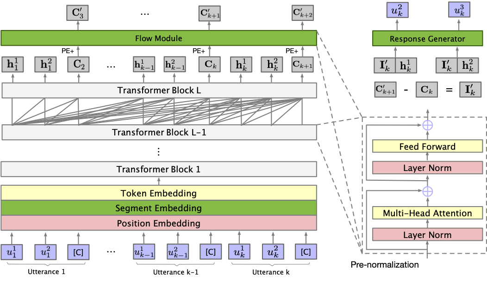

# Conversations are not Flat: Modeling the Intrinsic Information Flow between Dialogue Utterances
This repository contains the code and pre-trained models for our ACL 2021 paper Conversations are not Flat: Modeling the Intrinsic Information Flow between Dialogue Utterances. 

Our paper will be public soon!

**************************** **Updates** ****************************

* 5/10: We released the code and pre-trained model of **Flow Score**. Try to use it!


## Overview

We propose the **DialoFlow**, a new paradigm to construct the dynamic information flow in the dialogue history by addressing the semantic influence brought about by each utterance. Besides, we design an automatic reference-free evaluation metric **Flow Score** based on the pre-trained DialoFlow for interactive dialogue quality evaluation.




## DialoFlow

We will release the code and pre-trained models soon!


## Flow Score

**Flow Score** is an automatic reference-free evaluation metric for interactive dialogue evaluation based on the pre-trained DialoFlow. **Flow Score** can be found [here](https://github.com/ictnlp/DialoFlow/tree/main/FlowScore).


## Citation

Please cite our paper if you use DialoFlow in your work.

```bibtex
@inproceedings{li2021dialoflow,
   title={Conversations are not Flat: Modeling the Intrinsic Information Flow between Dialogue Utterances},
   author={Li, Zekang and Zhang, Jinchao and Fei, Zhengcong and Feng, Yang and Zhou, Jie},
   booktitle={Proceedings of the 59th Annual Meeting of the Association for Computational Linguistics},
   year={2021}
}
```
